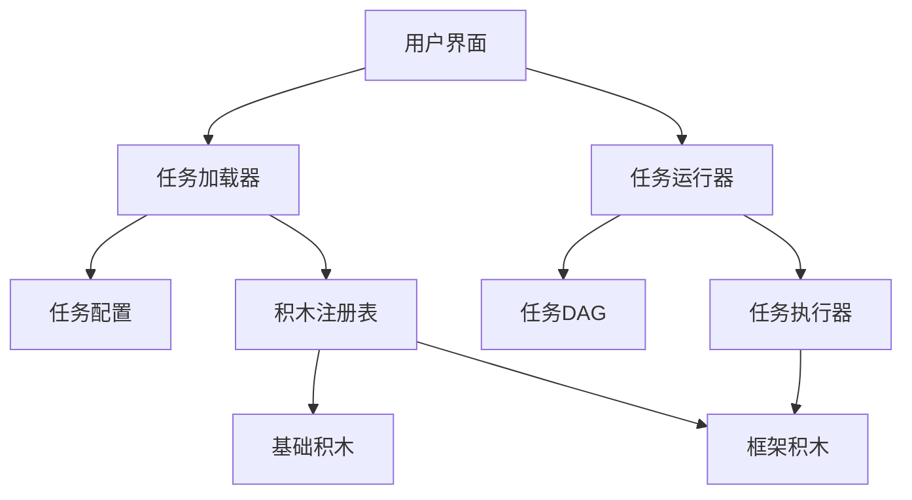

 # BrickDAG 任务系统文档

## 目录
1. [系统概述](#系统概述)
2. [核心概念](#核心概念)
3. [架构设计](#架构设计)
4. [安装与配置](#安装与配置)
5. [使用指南](#使用指南)
6. [扩展开发](#扩展开发)
7. [API参考](#api参考)
8. [最佳实践](#最佳实践)
9. [故障排除](#故障排除)

## 系统概述
BrickDAG 是一个高度解耦的插件式任务系统，专为 Neovim 设计。系统采用**积木式架构**，允许用户通过组合基础积木和框架积木来创建复杂的工作流。

### 核心特性
- **极限解耦**：核心系统永不修改，扩展只需添加新文件
- **任务编排**：支持任务依赖和拓扑排序
- **动态扩展**：运行时注册新积木类型
- **用户友好**：内置任务选择界面和队列管理
- **上下文感知**：支持变量替换和环境感知

## 核心概念
### 1. 基础积木 (Base Bricks)
负责参数解析和简单转换：
- 文件位置：`bricks/` 目录
- 接口要求：实现 `resolve(value, context)` 方法
- 示例：`cmd.lua`, `args.lua`, `env.lua`

### 2. 框架积木 (Frame Bricks)
负责业务逻辑和任务执行：
- 文件位置：`bricks/` 目录
- 接口要求：实现 `execute(exec_context)` 方法
- 示例：`make.lua`, `format.lua`, `build.lua`

### 3. 任务配置 (Task Configurations)
定义具体任务的执行参数：
- 文件位置：`tasks/` 目录
- 结构要求：包含 `name` 和 `type` 字段
- 示例：`make_example.lua`

## 架构设计


### 模块职责
| 模块 | 职责 |
|------|------|
| **积木注册表** | 管理所有积木的注册和查询 |
| **任务加载器** | 加载任务配置文件 |
| **任务DAG** | 构建任务依赖图并拓扑排序 |
| **任务执行器** | 执行单个任务并管理状态 |
| **任务运行器** | 协调整个任务执行流程 |
| **用户界面** | 提供任务选择和队列管理 |

## 安装与配置

### 1. 安装
将 `BrickDAG` 目录放入 Neovim 的 `lua/` 目录：
```
~/.config/nvim/
└── lua/
    └── BrickDAG/
        ├── bricks/
        ├── core/
        ├── ui/
        └── init.lua
```

### 2. 初始化
在 Neovim 配置中添加：
```lua
-- init.lua
require('BrickDAG').setup({
    runtime_tasks = {
        "custom.my_tasks"  -- 可选：自定义任务模块
    }
})
```

### 3. 默认快捷键
| 快捷键 | 功能 | 描述 |
|--------|------|------|
| `<leader>or` | 任务表 | 选择并执行任务 |
| `<leader>oa` | 添加任务到队列 | 选择任务添加到队列 |
| `<leader>oq` | 管理任务队列 | 查看和管理任务队列 |

## 使用指南

### 1. 运行单个任务
```vim
:lua require('BrickDAG.ui.interaction').pick_and_run()
```

### 2. 管理任务队列
```vim
" 添加任务到队列
:lua require('BrickDAG.ui.ui_queue').pick_task_and_enqueue()

" 管理任务队列
:lua require('BrickDAG.ui.ui_queue').manage_queue()

" 执行队列中的所有任务
:lua require('BrickDAG.ui.ui_queue').execute_all()
```

### 3. 创建简单任务
```lua
-- tasks/hello_world.lua
return {
    name = "打印欢迎信息",
    type = "echo",
    echo = {
        message = "欢迎使用 BrickDAG 任务系统!"
    }
}
```

## 扩展开发

### 1. 添加基础积木
```lua
-- bricks/timeout.lua
local TimeoutBrick = {
    name = "timeout",
    brick_type = "base"
}

function TimeoutBrick.resolve(value, context)
    -- 支持 "10s", "5m" 格式
    if type(value) == "string" then
        local num, unit = value:match("(%d+)(%a)")
        num = tonumber(num)
        if unit == "s" then return num * 1000 end
        if unit == "m" then return num * 60000 end
    end
    return tonumber(value) or 5000 -- 默认5秒
end

return TimeoutBrick
```

### 2. 添加框架积木
```lua
-- bricks/format.lua
local FormatFrame = {
    name = "format",
    brick_type = "frame"
}

function FormatFrame.execute(exec_context)
    local services = exec_context.services
    local config = exec_context.config

    -- 解析参数
    local resolved = services.resolver.resolve_parameters(config, {
        project_root = vim.fn.getcwd()
    })

    -- 执行格式化命令
    local cmd = resolved.cmd or "prettier"
    local args = resolved.args or {"--write"}
    local filetypes = resolved.filetypes or {}

    -- 构造完整命令
    local full_cmd = cmd .. " " .. table.concat(args, " ")

    -- 记录日志
    services.logger("格式化文件: " .. table.concat(filetypes, ", "), vim.log.levels.INFO)

    -- 执行命令
    local output = vim.fn.system(full_cmd)
    local exit_code = vim.v.shell_error

    if exit_code == 0 then
        return true, "格式化成功完成"
    else
        return false, "格式化失败: " .. output
    end
end

return FormatFrame
```

### 3. 创建复杂任务
```lua
-- tasks/full_pipeline.lua
return {
    name = "完整构建流程",
    deps = {"环境检查"},
    tasks = {
        {
            name = "代码格式化",
            type = "format",
            format = {
                cmd = "prettier",
                args = {"--write", "${project_root}/src/**/*.{js,ts}"},
                filetypes = {"javascript", "typescript"}
            }
        },
        {
            name = "运行测试",
            type = "test",
            test = {
                cmd = "jest",
                args = {"--coverage"},
                timeout = "30s"
            }
        },
        {
            name = "构建生产包",
            type = "build",
            build = {
                cmd = "webpack",
                args = {"--mode", "production"},
                output_dir = "${project_root}/dist"
            }
        }
    }
}
```

## API参考

### 核心模块

#### `bricks_registry.lua`
```lua
-- 注册基础积木
register_base_brick(brick)

-- 注册框架积木
register_frame_brick(frame)

-- 运行时注册基础积木
runtime_register_base_brick(brick)

-- 运行时注册框架积木
runtime_register_frame_brick(frame)

-- 获取积木
get(name)

-- 清除所有注册
clear()
```

#### `task_runner.lua`
```lua
-- 运行任务
run(tasks, on_done, services)
```

#### `task_executor.lua`
```lua
-- 创建执行器
new(services)

-- 执行任务
execute_task(context, task_id, task)
```

### 上下文对象
```lua
-- 标记任务完成
mark_completed(task_id)

-- 标记任务失败
mark_failed(task_id, err)

-- 设置上下文变量
set_var(key, value)

-- 获取上下文变量
get_var(key)
```

## 最佳实践

### 1. 任务设计原则
- **单一职责**：每个任务只做一件事
- **参数化**：使用变量使任务可配置
- **无状态**：任务不依赖外部状态
- **幂等性**：多次执行相同任务结果一致

### 2. 性能优化
- 避免在热路径中进行复杂计算
- 对大文件使用流式处理
- 并行化独立任务执行
- 缓存重复使用的计算结果

### 3. 错误处理
- 所有框架积木必须捕获异常
- 返回详细的错误信息
- 记录错误日志
- 提供错误恢复机制

### 4. 安全建议
- 验证所有输入参数
- 避免执行未经验证的外部命令
- 限制动态函数执行权限
- 对敏感数据使用环境变量

## 故障排除

### 常见问题及解决方案

| 问题现象 | 可能原因 | 解决方案 |
|----------|----------|----------|
| **任务未加载** | 任务文件不在 `tasks/` 目录 | 检查文件位置和命名 |
| **积木未注册** | 缺少 `brick_type` 字段 | 确保积木包含 `brick_type = "base"` 或 `"frame"` |
| **依赖解析失败** | 循环依赖 | 检查任务 `deps` 字段 |
| **变量未替换** | 上下文缺少变量 | 确保上下文包含 `${var}` 中的变量 |
| **命令执行失败** | 权限问题或路径错误 | 使用绝对路径或检查权限 |

### 调试技巧
1. 启用详细日志：
   ```lua
   vim.notify("调试信息", vim.log.levels.DEBUG)
   ```

2. 检查任务拓扑：
   ```lua
   local dag = require("BrickDAG.core.task_dag").new()
   dag:add_task(task)
   print(vim.inspect(dag:topo_sort()))
   ```

3. 手动执行积木：
   ```lua
   local brick = require("BrickDAG.core.bricks_registry").get("make")
   brick.execute({cmd = "echo", args = {"测试"}})
   ```

### 获取支持
如遇无法解决的问题，请提供以下信息：
1. Neovim 版本：`:version`
2. 操作系统信息
3. 错误日志：`:messages`
4. 相关配置文件
5. 复现步骤

---

> BrickDAG 任务系统遵循 **MIT 许可证**
> 版本: 1.0.0 | 更新日期: 2023-10-01
> 保持核心简单，让扩展无限可能！
